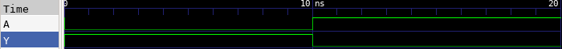

# 🔘 NOT Gate Lab

This lab demonstrates how to implement a simple 1-input NOT gate (inverter) in Verilog, test it using a testbench, and observe the waveform using GTKWave.

---

## 📄 Verilog Design

### `not_gate.v`

```verilog
// not_gate.v
// 1-input NOT gate module (Inverter)

module not_gate(
    input A,      // Input
    output Y      // Output = ~A
);

    assign Y = ~A;  // Perform bitwise NOT operation

endmodule
```

---

## 🧪 Testbench

### `not_gate_tb.v`

```verilog
// not_gate_tb.v
// Testbench for 1-input NOT gate

`timescale 1ns / 1ps

module not_gate_tb;

    // Declare testbench signals
    reg A;
    wire Y;

    // Instantiate the design under test (DUT)
    not_gate dut (
        .A(A),
        .Y(Y)
    );

    // Apply test stimulus
    initial begin
        $dumpfile("not_gate.vcd");      // Output VCD file
        $dumpvars(0, not_gate_tb);      // Dump all variables

        A = 0; #10;
        A = 1; #10;

        $finish;
    end

endmodule
```

---

## ⚙️ Simulation Commands

```bash
# Compile the Verilog source and testbench into an executable
iverilog -o not_gate.vvp not_gate.v not_gate_tb.v

# Run the simulation using the compiled file
vvp not_gate.vvp

# Launch GTKWave to view the waveform from the generated VCD file
gtkwave not_gate.vcd
```

---

## 📷 Simulation Result


