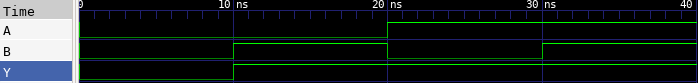

# 🔘 OR Gate Lab

This lab demonstrates how to implement a simple 2-input OR gate in Verilog, test it using a testbench, and observe the waveform using GTKWave.

---

## 📄 Verilog Design

### `or_gate.v`

```verilog
// or_gate.v
// 2-input OR gate module

module or_gate(
    input A,      // First input
    input B,      // Second input
    output Y      // Output = A OR B
);

    assign Y = A | B;  // Perform bitwise OR operation

endmodule
```

---

## 🧪 Testbench

### `or_gate_tb.v`

```verilog
// or_gate_tb.v
// Testbench for 2-input OR gate

`timescale 1ns / 1ps

module or_gate_tb;

    // Declare testbench signals
    reg A;
    reg B;
    wire Y;

    // Instantiate the design under test (DUT)
    or_gate dut (
        .A(A),
        .B(B),
        .Y(Y)
    );

    // Apply test stimulus
    initial begin
        $dumpfile("or_gate.vcd");  // Output VCD file
        $dumpvars(0, or_gate_tb);  // Dump all variables

        A = 0; B = 0; #10;
        A = 0; B = 1; #10;
        A = 1; B = 0; #10;
        A = 1; B = 1; #10;

        $finish;
    end

endmodule
```

---

## ⚙️ Simulation Commands

```bash
# Compile the Verilog source and testbench into an executable
iverilog -o or_gate.vvp or_gate.v or_gate_tb.v

# Run the simulation using the compiled file
vvp or_gate.vvp

# Launch GTKWave to view the waveform from the generated VCD file
gtkwave or_gate.vcd
```

---

## 📷 Simulation Result


