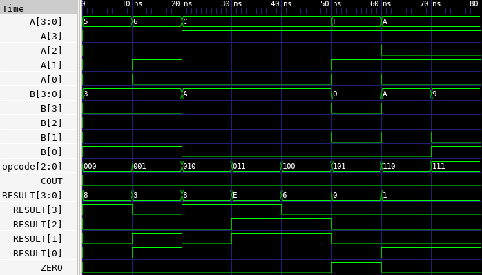

# 🔘 4-bit ALU Lab

This lab implements a 4-bit ALU in Verilog that supports multiple arithmetic and logical operations based on an opcode. It also includes a testbench to verify its functionality.

---

## 📄 Verilog Design

### `alu_4bit.v`

```verilog
// alu_4bit.v
// 4-bit Arithmetic Logic Unit

module alu_4bit(
    input  [3:0] A,        // 4-bit input A
    input  [3:0] B,        // 4-bit input B
    input  [2:0] opcode,   // Operation select
    output reg [3:0] RESULT, // Operation result
    output reg COUT,       // Carry-out or flag
    output ZERO            // Zero flag (1 if result is 0)
);

    assign ZERO = (RESULT == 4'b0000);

    always @(*) begin
        case (opcode)
            3'b000: {COUT, RESULT} = A + B;               // ADD
            3'b001: {COUT, RESULT} = A - B;               // SUB
            3'b010: {COUT, RESULT} = {1'b0, A & B};       // AND
            3'b011: {COUT, RESULT} = {1'b0, A | B};       // OR
            3'b100: {COUT, RESULT} = {1'b0, A ^ B};       // XOR
            3'b101: {COUT, RESULT} = {1'b0, ~A};          // NOT A
            3'b110: {COUT, RESULT} = {3'b000, (A == B)};  // Equal check
            3'b111: {COUT, RESULT} = {3'b000, (A > B)};   // Greater-than check
            default: {COUT, RESULT} = 5'b00000;
        endcase
    end

endmodule
```

---

## 🧪 Testbench

### `alu_4bit_tb.v`

```verilog
// alu_4bit_tb.v
// Testbench for 4-bit ALU

`timescale 1ns / 1ps

module alu_4bit_tb;

    reg  [3:0] A, B;
    reg  [2:0] opcode;
    wire [3:0] RESULT;
    wire COUT;
    wire ZERO;

    alu_4bit dut (
        .A(A), .B(B),
        .opcode(opcode),
        .RESULT(RESULT),
        .COUT(COUT),
        .ZERO(ZERO)
    );

    initial begin
        $dumpfile("alu_4bit.vcd");
        $dumpvars(0, alu_4bit_tb);

        // Test cases
        A = 4'b0101; B = 4'b0011; opcode = 3'b000; #10;  // ADD
        A = 4'b0110; B = 4'b0011; opcode = 3'b001; #10;  // SUB
        A = 4'b1100; B = 4'b1010; opcode = 3'b010; #10;  // AND
        A = 4'b1100; B = 4'b1010; opcode = 3'b011; #10;  // OR
        A = 4'b1100; B = 4'b1010; opcode = 3'b100; #10;  // XOR
        A = 4'b1111; B = 4'b0000; opcode = 3'b101; #10;  // NOT A
        A = 4'b1010; B = 4'b1010; opcode = 3'b110; #10;  // A == B
        A = 4'b1010; B = 4'b1001; opcode = 3'b111; #10;  // A > B

        $finish;
    end

endmodule
```

---

## ⚙️ Simulation Commands

```bash
# Compile the Verilog source and testbench into an executable
iverilog -o alu_4bit.vvp alu_4bit.v alu_4bit_tb.v

# Run the simulation using the compiled file
vvp alu_4bit.vvp

# Launch GTKWave to view the waveform from the generated VCD file
gtkwave alu_4bit.vcd
```

---

## 📷 Simulation Result


