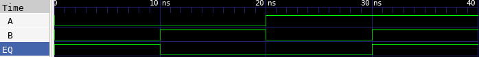

# 🔘 1-Bit Comparator Lab

This lab demonstrates how to implement a 1-bit comparator in Verilog, test it using a testbench, and observe the waveform using GTKWave.

---

## 📄 Verilog Design

### `comparator_1bit.v`

```verilog
// comparator_1bit.v
// 1-bit comparator: checks if A == B

module comparator_1bit(
    input A,      // First input
    input B,      // Second input
    output EQ     // Output: 1 if A == B, else 0
);

    assign EQ = ~(A ^ B);  // EQ is 1 when A == B

endmodule
```

---

## 🧪 Testbench

### `comparator_1bit_tb.v`

```verilog
// comparator_1bit_tb.v
// Testbench for 1-bit comparator

`timescale 1ns / 1ps

module comparator_1bit_tb;

    reg A;
    reg B;
    wire EQ;

    // Instantiate DUT (Device Under Test)
    comparator_1bit dut (
        .A(A),
        .B(B),
        .EQ(EQ)
    );

    initial begin
        $dumpfile("comparator_1bit.vcd");   // VCD file for waveform
        $dumpvars(0, comparator_1bit_tb);   // Dump all signals

        A = 0; B = 0; #10;
        A = 0; B = 1; #10;
        A = 1; B = 0; #10;
        A = 1; B = 1; #10;

        $finish;
    end

endmodule
```

---

## ⚙️ Simulation Commands

```bash
# Compile the Verilog source and testbench into an executable
iverilog -o comparator_1bit.vvp comparator_1bit.v comparator_1bit_tb.v

# Run the simulation using the compiled file
vvp comparator_1bit.vvp

# Launch GTKWave to view the waveform from the generated VCD file
gtkwave comparator_1bit.vcd
```

---

## 📷 Simulation Result


