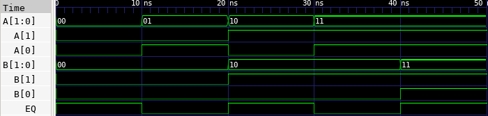

# 🔘 2-Bit Comparator Lab

This lab demonstrates how to implement a 2-bit comparator in Verilog, test it using a testbench, and observe the waveform using GTKWave.

---

## 📄 Verilog Design

### `comparator_2bit.v`

```verilog
// comparator_2bit.v
// 2-bit comparator: checks if A == B

module comparator_2bit(
    input [1:0] A,    // 2-bit input A
    input [1:0] B,    // 2-bit input B
    output EQ         // Output: 1 if A == B
);

    assign EQ = (A == B);  // EQ is 1 if all bits match

endmodule
```

---

## 🧪 Testbench

### `comparator_2bit_tb.v`

```verilog
// comparator_2bit_tb.v
// Testbench for 2-bit comparator

`timescale 1ns / 1ps

module comparator_2bit_tb;

    reg [1:0] A;
    reg [1:0] B;
    wire EQ;

    // Instantiate DUT
    comparator_2bit dut (
        .A(A),
        .B(B),
        .EQ(EQ)
    );

    initial begin
        $dumpfile("comparator_2bit.vcd");
        $dumpvars(0, comparator_2bit_tb);

        A = 2'b00; B = 2'b00; #10;
        A = 2'b01; B = 2'b00; #10;
        A = 2'b10; B = 2'b10; #10;
        A = 2'b11; B = 2'b10; #10;
        A = 2'b11; B = 2'b11; #10;

        $finish;
    end

endmodule
```

---

## ⚙️ Simulation Commands

```bash
# Compile the Verilog source and testbench into an executable
iverilog -o comparator_2bit.vvp comparator_2bit.v comparator_2bit_tb.v

# Run the simulation using the compiled file
vvp comparator_2bit.vvp

# Launch GTKWave to view the waveform from the generated VCD file
gtkwave comparator_2bit.vcd
```

---

## 📷 Simulation Result


