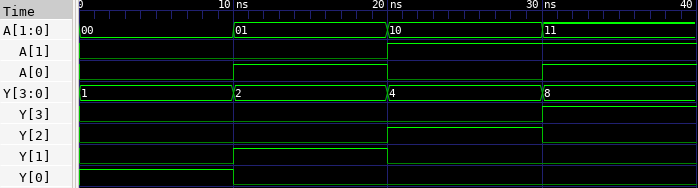

# 🔘 2:4 Decoder Lab

This lab demonstrates how to implement a 2-to-4 decoder in Verilog, test it using a testbench, and observe the waveform using GTKWave. A 2:4 decoder takes a 2-bit input and activated one of 4 outputs based on that input. Only one output is 1, the rest are 0.

---

## 📄 Verilog Design

### `decoder2to4.v`

```verilog
// decoder2to4.v
// 2-to-4 Line Decoder

module decoder2to4(
    input [1:0] A,    // 2-bit input
    output [3:0] Y    // 4-bit output
);

    assign Y[0] = (A == 2'b00);
    assign Y[1] = (A == 2'b01);
    assign Y[2] = (A == 2'b10);
    assign Y[3] = (A == 2'b11);

endmodule
```

---

## 🧪 Testbench

### `decoder2to4_tb.v`

```verilog
// decoder2to4_tb.v
// Testbench for 2-to-4 Decoder

`timescale 1ns / 1ps

module decoder2to4_tb;

    reg [1:0] A;
    wire [3:0] Y;

    decoder2to4 dut (
        .A(A),
        .Y(Y)
    );

    initial begin
        $dumpfile("decoder2to4.vcd");
        $dumpvars(0, decoder2to4_tb);

        A = 2'b00; #10;
        A = 2'b01; #10;
        A = 2'b10; #10;
        A = 2'b11; #10;

        $finish;
    end

endmodule
```

---

## ⚙️ Simulation Commands

```bash
# Compile the Verilog source and testbench into an executable
iverilog -o decoder2to4.vvp decoder2to4.v decoder2to4_tb.v

# Run the simulation using the compiled file
vvp decoder2to4.vvp

# Launch GTKWave to view the waveform from the generated VCD file
gtkwave decoder2to4.vcd
```

---

## 📷 Simulation Result


