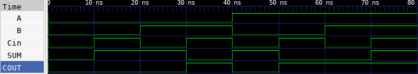

# 🔘 Full Adder Lab

This lab demonstrates how to implement a full adder in Verilog. A full adder adds three 1-bit binary numbers: A, B, and Carry-in (Cin), and outputs Sum and Carry-out (Cout). Sum = A ⊕ B ⊕ Cin, Carry = (A ⋅ B) + (B ⋅ Cin) + (A ⋅ Cin)

---

## 📄 Verilog Design

### `full_adder.v`

```verilog
// full_adder.v
// 1-bit Full Adder module

module full_adder(
    input A,       // First input bit
    input B,       // Second input bit
    input Cin,     // Carry-in
    output SUM,    // Sum output
    output COUT    // Carry-out output
);

    assign SUM  = A ^ B ^ Cin;                           // XOR for sum
    assign COUT = (A & B) | (B & Cin) | (A & Cin);       // Majority logic for carry

endmodule
```

---

## 🧪 Testbench

### `full_adder_tb.v`

```verilog
// full_adder_tb.v
// Testbench for 1-bit Full Adder

`timescale 1ns / 1ps

module full_adder_tb;

    // Testbench signals
    reg A;
    reg B;
    reg Cin;
    wire SUM;
    wire COUT;

    // Instantiate the DUT (Device Under Test)
    full_adder dut (
        .A(A),
        .B(B),
        .Cin(Cin),
        .SUM(SUM),
        .COUT(COUT)
    );

    initial begin
        $dumpfile("full_adder.vcd");
        $dumpvars(0, full_adder_tb);

        A = 0; B = 0; Cin = 0; #10;
        A = 0; B = 0; Cin = 1; #10;
        A = 0; B = 1; Cin = 0; #10;
        A = 0; B = 1; Cin = 1; #10;
        A = 1; B = 0; Cin = 0; #10;
        A = 1; B = 0; Cin = 1; #10;
        A = 1; B = 1; Cin = 0; #10;
        A = 1; B = 1; Cin = 1; #10;

        $finish;
    end

endmodule
```

---

## ⚙️ Simulation Commands

```bash
# Compile the Verilog source and testbench into an executable
iverilog -o full_adder.vvp full_adder.v full_adder_tb.v

# Run the simulation using the compiled file
vvp full_adder.vvp

# Launch GTKWave to view the waveform from the generated VCD file
gtkwave full_adder.vcd
```

---

## 📷 Simulation Result


