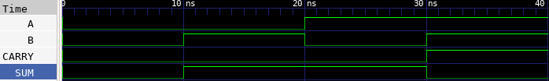

# 🔘 Half Adder Lab

This lab demonstrates how to implement a half adder in Verilog. A half adder takes two binary inputs and produces a sum and a carry output.
Sum = A ⊕ B, Carry = A ⋅ B

---

## 📄 Verilog Design

### `half_adder.v`

```verilog
// half_adder.v
// 2-bit Half Adder module

module half_adder(
    input A,      // First input
    input B,      // Second input
    output SUM,   // Sum = A ^ B
    output CARRY  // Carry = A & B
);

    assign SUM = A ^ B;     // XOR for sum
    assign CARRY = A & B;   // AND for carry

endmodule
```

---

## 🧪 Testbench

### `half_adder_tb.v`

```verilog
// half_adder_tb.v
// Testbench for Half Adder

`timescale 1ns / 1ps

module half_adder_tb;

    // Declare testbench signals
    reg A;
    reg B;
    wire SUM;
    wire CARRY;

    // Instantiate the design under test (DUT)
    half_adder dut (
        .A(A),
        .B(B),
        .SUM(SUM),
        .CARRY(CARRY)
    );

    // Apply test stimulus
    initial begin
        $dumpfile("half_adder.vcd");
        $dumpvars(0, half_adder_tb);

        A = 0; B = 0; #10;
        A = 0; B = 1; #10;
        A = 1; B = 0; #10;
        A = 1; B = 1; #10;

        $finish;
    end

endmodule
```

---

## ⚙️ Simulation Commands

```bash
# Compile the Verilog source and testbench into an executable
iverilog -o half_adder.vvp half_adder.v half_adder_tb.v

# Run the simulation using the compiled file
vvp half_adder.vvp

# Launch GTKWave to view the waveform from the generated VCD file
gtkwave half_adder.vcd
```

---

## 📷 Simulation Result


