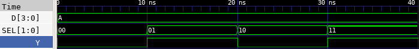

# 🔘 4:1 Multiplexer (MUX) Lab

This lab demonstrates how to implement a 4-to-1 multiplexer in Verilog, test it using a testbench, and observe the waveform using GTKWave. A 4:1 MUX selects one of the four input signals based on a 2-bit select line and routes it to the output.

---

## 📄 Verilog Design

### `mux4to1.v`

```verilog
// mux4to1.v
// 4-to-1 Multiplexer

module mux4to1(
    input [3:0] D,       // 4-bit input data lines (D[3], D[2], D[1], D[0])
    input [1:0] SEL,     // 2-bit select signal
    output Y             // Output
);

    assign Y = (SEL == 2'b00) ? D[0] :
               (SEL == 2'b01) ? D[1] :
               (SEL == 2'b10) ? D[2] :
                                D[3];

endmodule
```

---

## 🧪 Testbench

### `mux4to1_tb.v`

```verilog
// mux4to1_tb.v
// Testbench for 4-to-1 Multiplexer

`timescale 1ns / 1ps

module mux4to1_tb;

    reg [3:0] D;
    reg [1:0] SEL;
    wire Y;

    // Instantiate DUT
    mux4to1 dut (
        .D(D),
        .SEL(SEL),
        .Y(Y)
    );

    initial begin
        $dumpfile("mux4to1.vcd");
        $dumpvars(0, mux4to1_tb);

        D = 4'b1010;  // D[3]=1, D[2]=0, D[1]=1, D[0]=0

        SEL = 2'b00; #10;  // Expect Y = D[0] = 0
        SEL = 2'b01; #10;  // Expect Y = D[1] = 1
        SEL = 2'b10; #10;  // Expect Y = D[2] = 0
        SEL = 2'b11; #10;  // Expect Y = D[3] = 1

        $finish;
    end

endmodule
```

---

## ⚙️ Simulation Commands

```bash
# Compile the Verilog source and testbench into an executable
iverilog -o mux4to1.vvp mux4to1.v mux4to1_tb.v

# Run the simulation using the compiled file
vvp mux4to1.vvp

# Launch GTKWave to view the waveform from the generated VCD file
gtkwave mux4to1.vcd
```

---

## 📷 Simulation Result


