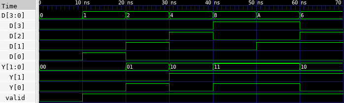

# 🔘 Priority Encoder (4:2) Lab

This lab demonstrates how to implement a 4-to-2 Priority Encoder in Verilog, where input bits are encoded into a 2-bit binary output, giving priority to the highest-indexed active input. The output also includes a valid bit indicating whether any input was active.

---

## 📄 Verilog Design

### `priority_encoder_4to2.v`

```verilog
// priority_encoder_4to2.v
// 4-to-2 Priority Encoder with valid output

module priority_encoder_4to2(
    input  [3:0] D,     // 4-bit input
    output reg [1:0] Y, // 2-bit encoded output
    output reg valid    // Indicates if any input is high
);

    always @(*) begin
        valid = 1'b1;
        casex (D)
            4'b1xxx: Y = 2'b11; // D[3] has highest priority
            4'b01xx: Y = 2'b10; // D[2]
            4'b001x: Y = 2'b01; // D[1]
            4'b0001: Y = 2'b00; // D[0]
            4'b0000: begin
                Y = 2'b00;
                valid = 1'b0;    // No input is active
            end
            default: begin
                Y = 2'b00;
                valid = 1'b0;
            end
        endcase
    end

endmodule
```

---

## 🧪 Testbench

### `priority_encoder_4to2_tb.v`

```verilog
// priority_encoder_4to2_tb.v
// Testbench for 4-to-2 Priority Encoder

`timescale 1ns / 1ps

module priority_encoder_4to2_tb;

    reg  [3:0] D;
    wire [1:0] Y;
    wire valid;

    // Instantiate DUT
    priority_encoder_4to2 dut (
        .D(D),
        .Y(Y),
        .valid(valid)
    );

    initial begin
        $dumpfile("priority_encoder_4to2.vcd");
        $dumpvars(0, priority_encoder_4to2_tb);

        D = 4'b0000; #10;
        D = 4'b0001; #10;
        D = 4'b0010; #10;
        D = 4'b0100; #10;
        D = 4'b1000; #10;
        D = 4'b1010; #10;  // Should prioritize D[3]
        D = 4'b0110; #10;  // Should prioritize D[2]

        $finish;
    end

endmodule
```

---

## ⚙️ Simulation Commands

```bash
# Compile the Verilog source and testbench into an executable
iverilog -o priority_encoder_4to2.vvp priority_encoder_4to2.v priority_encoder_4to2_tb.v

# Run the simulation using the compiled file
vvp priority_encoder_4to2.vvp

# Launch GTKWave to view the waveform from the generated VCD file
gtkwave priority_encoder_4to2.vcd
```

---

## 📷 Simulation Result


