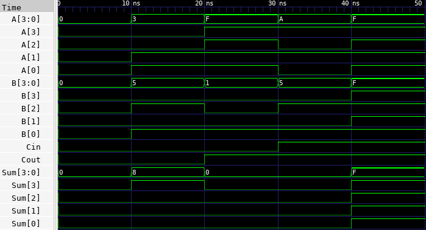

# 🔘 4-bit Ripple Carry Adder Lab

This lab demonstrates how to implement a 4-bit ripple carry adder in Verilog by cascading four 1-bit full adders. The purpose is to understand hierarchical design and how carry signals propagate across bits during binary addition.

---

## 📄 Verilog Design

### `ripple_carry_adder_4bit.v`

```verilog
// ripple_carry_adder_4bit.v
// 4-bit Ripple Carry Adder using external 1-bit Full Adder modules

module ripple_carry_adder_4bit (
    input  [3:0] A, B,
    input        Cin,
    output [3:0] Sum,
    output       Cout
);
    wire c1, c2, c3;

    full_adder fa0 (.A(A[0]), .B(B[0]), .Cin(Cin), .SUM(Sum[0]), .COUT(c1));
    full_adder fa1 (.A(A[1]), .B(B[1]), .Cin(c1),  .SUM(Sum[1]), .COUT(c2));
    full_adder fa2 (.A(A[2]), .B(B[2]), .Cin(c2),  .SUM(Sum[2]), .COUT(c3));
    full_adder fa3 (.A(A[3]), .B(B[3]), .Cin(c3),  .SUM(Sum[3]), .COUT(Cout));
endmodule
```

---

## 🧪 Testbench

### `ripple_carry_adder_4bit_tb.v`

```verilog
// ripple_carry_adder_4bit_tb.v
// Testbench for 4-bit Ripple Carry Adder

`timescale 1ns / 1ps

module ripple_carry_adder_4bit_tb;

    reg  [3:0] A, B;
    reg        Cin;
    wire [3:0] Sum;
    wire       Cout;

    // Instantiate the DUT
    ripple_carry_adder_4bit dut (
        .A(A), .B(B), .Cin(Cin),
        .Sum(Sum), .Cout(Cout)
    );

    initial begin
        $dumpfile("ripple_carry_adder_4bit.vcd");
        $dumpvars(0, ripple_carry_adder_4bit_tb);

        // Test vectors
        A = 4'b0000; B = 4'b0000; Cin = 0; #10;
        A = 4'b0011; B = 4'b0101; Cin = 0; #10;
        A = 4'b1111; B = 4'b0001; Cin = 0; #10;
        A = 4'b1010; B = 4'b0101; Cin = 1; #10;
        A = 4'b1111; B = 4'b1111; Cin = 1; #10;

        $finish;
    end

endmodule
```

---

## ⚙️ Simulation Commands

```bash
# Compile the Verilog source and testbench into an executable
iverilog -o ripple_carry_adder_4bit.vvp ripple_carry_adder_4bit.v ripple_carry_adder_4bit_tb.v

# Run the simulation using the compiled file
vvp ripple_carry_adder_4bit.vvp

# Launch GTKWave to view the waveform from the generated VCD file
gtkwave ripple_carry_adder_4bit.vcd
```

---

## 📷 Simulation Result


