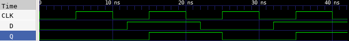

# 🔘 D Flip-Flop Lab

This lab demonstrates how to implement a D-type Flip-Flop in Verilog, test it using a testbench, and observe the waveform using GTKWave.

---

## 📄 Verilog Design

### `d_flip_flop.v`

```verilog
// d_flip_flop.v
// D Flip-Flop with positive-edge clock

module d_flip_flop (
    input D,       // Data input
    input CLK,     // Clock input
    output reg Q   // Output (registered)
);

    // Trigger on rising edge of clock
    always @(posedge CLK) begin
        Q <= D;    // On clock edge, capture input D into Q
    end

endmodule
```

---

## 🧪 Testbench

### `d_flip_flop_tb.v`

```verilog
// d_flip_flop_tb.v
// Testbench for D Flip-Flop

`timescale 1ns / 1ps

module d_flip_flop_tb;

    reg D;
    reg CLK;
    wire Q;

    // Instantiate the D Flip-Flop
    d_flip_flop dut (
        .D(D),
        .CLK(CLK),
        .Q(Q)
    );

    // Clock generator: 10ns period
    always begin
        CLK = 0; #5;
        CLK = 1; #5;
    end

    // Stimulus
    initial begin
        $dumpfile("d_flip_flop.vcd");
        $dumpvars(0, d_flip_flop_tb);

        D = 0; #12;
        D = 1; #10;
        D = 0; #10;
        D = 1; #10;

        $finish;
    end

endmodule
```

---

## ⚙️ Simulation Commands

```bash
# Compile the Verilog source and testbench into an executable
iverilog -o d_flip_flop.vvp d_flip_flop.v d_flip_flop_tb.v

# Run the simulation using the compiled file
vvp d_flip_flop.vvp

# Launch GTKWave to view the waveform from the generated VCD file
gtkwave d_flip_flop.vcd
```

---

## 📷 Simulation Result


