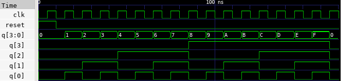

# 🔘 T Counter Lab

This lab demonstrates how to implement a 4-bit up/down counter using T Flip-Flops in Verilog. The design responds to a clock signal and counts either upward or downward depending on the up_down control signal. The simulation result is verified using GTKWave.


---

## 📄 Verilog Design

### `t_flip_flop.v`

```verilog
// t_flip_flop.v
// T Flip-Flop with asynchronous reset

module t_flip_flop (
    input clk,
    input reset,
    input T,
    output reg Q
);

    always @(posedge clk or posedge reset) begin
        if (reset)
            Q <= 1'b0;
        else if (T)
            Q <= ~Q;
    end

endmodule
```

### `t_counter.v`

```verilog
// t_counter.v
// 4-bit Up/Down Counter using T Flip-Flops

module t_counter (
    input clk,         // Clock
    input reset,       // Asynchronous Reset
    input updn,        // Up/Down control: 1 = count up, 0 = count down
    output [3:0] Q     // 4-bit counter output
);

    wire T0, T1, T2, T3;

    // T Flip-Flop toggle control logic for Up/Down counting
    assign T0 = 1'b1;
    assign T1 = updn ? Q[0]                  : ~Q[0];
    assign T2 = updn ? Q[0] & Q[1]           : ~Q[0] & ~Q[1];
    assign T3 = updn ? Q[0] & Q[1] & Q[2]    : ~Q[0] & ~Q[1] & ~Q[2];

    // Instantiate T Flip-Flops
    t_flip_flop tff0 (.clk(clk), .reset(reset), .T(T0), .Q(Q[0]));
    t_flip_flop tff1 (.clk(clk), .reset(reset), .T(T1), .Q(Q[1]));
    t_flip_flop tff2 (.clk(clk), .reset(reset), .T(T2), .Q(Q[2]));
    t_flip_flop tff3 (.clk(clk), .reset(reset), .T(T3), .Q(Q[3]));

endmodule
```

---

## 🧪 Testbench

### `t_counter_tb.v`

```verilog
// t_counter_tb.v
// Testbench for 4-bit Up/Down Counter

`timescale 1ns / 1ps

module t_counter_tb;

    reg clk;
    reg reset;
    reg updn;
    wire [3:0] Q;

    // Instantiate the counter
    t_counter dut (
        .clk(clk),
        .reset(reset),
        .updn(updn),
        .Q(Q)
    );

    // Clock generation (10ns period)
    always #5 clk = ~clk;

    initial begin
        $dumpfile("t_counter.vcd");
        $dumpvars(0, t_counter_tb);

        // Init
        clk = 0;
        reset = 1;
        updn = 1;
        #10;

        reset = 0;

        // Count up for 10 cycles
        updn = 1;
        repeat (10) #10;

        // Count down for 10 cycles
        updn = 0;
        repeat (10) #10;

        $finish;
    end

endmodule
```

---

## ⚙️ Simulation Commands

```bash
# Compile the Verilog source and testbench into an executable
iverilog -o t_counter.vvp t_counter.v t_flip_flop.v t_counter_tb.v

# Run the simulation using the compiled file
vvp t_counter.vvp

# Launch GTKWave to view the waveform from the generated VCD file
gtkwave t_counter.vcd
```

---

## 📷 Simulation Result


