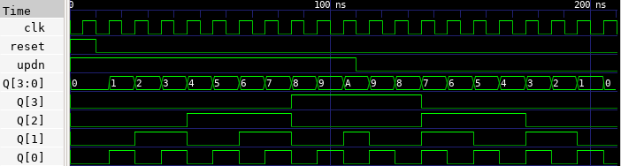

# 🔘 T Counter Lab

This lab demonstrates how to implement a 4-bit up/down counter using T Flip-Flops in Verilog. The design responds to a clock signal and counts either upward or downward depending on the up_down control signal. The simulation result is verified using GTKWave.


---

## 📄 Verilog Design

### `t_counter.v`

```verilog
// t_counter.v
// 4-bit Up/Down Counter using T Flip-Flops

module t_counter (
    input clk,         // Clock input
    input reset,       // Asynchronous reset
    input up_down,     // Up (1) or Down (0) counter control
    output [3:0] Q     // 4-bit output
);

    // Internal wires for T Flip-Flops
    wire t0, t1, t2, t3;
    wire q0, q1, q2, q3;

    // T Flip-Flop instances
    t_flip_flop ff0 (
        .T(t0),
        .CLK(clk),
        .Q(q0)
    );

    t_flip_flop ff1 (
        .T(t1),
        .CLK(q0),
        .Q(q1)
    );

    t_flip_flop ff2 (
        .T(t2),
        .CLK(q1),
        .Q(q2)
    );

    t_flip_flop ff3 (
        .T(t3),
        .CLK(q2),
        .Q(q3)
    );

    // Output assignment
    assign Q = {q3, q2, q1, q0};

    // T inputs for up/down control
    assign t0 = up_down;
    assign t1 = q0 ^ up_down;
    assign t2 = q1 ^ up_down;
    assign t3 = q2 ^ up_down;

endmodule
```

### `t_flip_flop.v`

```verilog
// t_flip_flop.v
// T Flip-Flop Module

module t_flip_flop (
    input T,       // Toggle input
    input CLK,     // Clock input
    output reg Q   // Output (registered)
);

    // Initialize Q to 0
    initial begin
        Q = 0;
    end

    // Toggle behavior on positive edge
    always @(posedge CLK) begin
        if (T)
            Q <= ~Q;
        else
            Q <= Q;
    end

endmodule
```

---

## 🧪 Testbench

### `t_counter_tb.v`

```verilog
// t_counter_tb.v
// Testbench for T Flip-Flop Up/Down Counter

`timescale 1ns / 1ps

module t_counter_tb;

    reg clk;
    reg reset;
    reg up_down;
    wire [3:0] Q;

    // Instantiate the DUT
    t_counter uut (
        .clk(clk),
        .reset(reset),
        .up_down(up_down),
        .Q(Q)
    );

    // Clock generation
    always begin
        clk = 0; #5;
        clk = 1; #5;
    end

    // Test sequence
    initial begin
        $dumpfile("t_counter.vcd");
        $dumpvars(0, t_counter_tb);

        // Initial setup
        up_down = 1;   // Count up
        #10;

        // Count up for 8 cycles
        #80;

        // Switch to count down
        up_down = 0;
        #80;

        $finish;
    end

endmodule
```

---

## ⚙️ Simulation Commands

```bash
# Compile the Verilog source and testbench into an executable
iverilog -o t_counter.vvp t_counter.v t_flip_flop.v t_counter_tb.v

# Run the simulation using the compiled file
vvp t_counter.vvp

# Launch GTKWave to view the waveform from the generated VCD file
gtkwave t_counter.vcd
```

---

## 📷 Simulation Result


