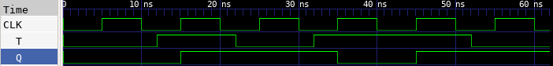

# 🔘 T Flip-Flop Lab

This lab demonstrates how to implement a T-type Flip-Flop in Verilog, test it using a testbench, and observe the waveform using GTKWave.

---

## 📄 Verilog Design

### `t_flip_flop.v`

```verilog
// t_flip_flop.v
// T Flip-Flop with positive-edge clock

module t_flip_flop (
    input T,       // Toggle input
    input CLK,     // Clock input
    output reg Q   // Output (registered)
);

    // On positive clock edge
    always @(posedge CLK) begin
        if (T)
            Q <= ~Q;  // Toggle output
        else
            Q <= Q;   // Hold previous state
    end

endmodule
```

---

## 🧪 Testbench

### `t_flip_flop_tb.v`

```verilog
// t_flip_flop_tb.v
// Testbench for T Flip-Flop

`timescale 1ns / 1ps

module t_flip_flop_tb;

    reg T;
    reg CLK;
    wire Q;

    // Instantiate T Flip-Flop
    t_flip_flop dut (
        .T(T),
        .CLK(CLK),
        .Q(Q)
    );

    // Clock generator: 10ns period
    always begin
        CLK = 0; #5;
        CLK = 1; #5;
    end

    // Stimulus
    initial begin
        $dumpfile("t_flip_flop.vcd");
        $dumpvars(0, t_flip_flop_tb);

        T = 0; #12;  // Hold
        T = 1; #10;  // Toggle
        T = 0; #10;  // Hold
        T = 1; #10;  // Toggle
        T = 1; #10;  // Toggle again
        T = 0; #10;  // Hold

        $finish;
    end

endmodule
```

---

## ⚙️ Simulation Commands

```bash
# Compile the Verilog source and testbench into an executable
iverilog -o t_flip_flop.vvp t_flip_flop.v t_flip_flop_tb.v

# Run the simulation using the compiled file
vvp t_flip_flop.vvp

# Launch GTKWave to view the waveform from the generated VCD file
gtkwave t_flip_flop.vcd
```

---

## 📷 Simulation Result


